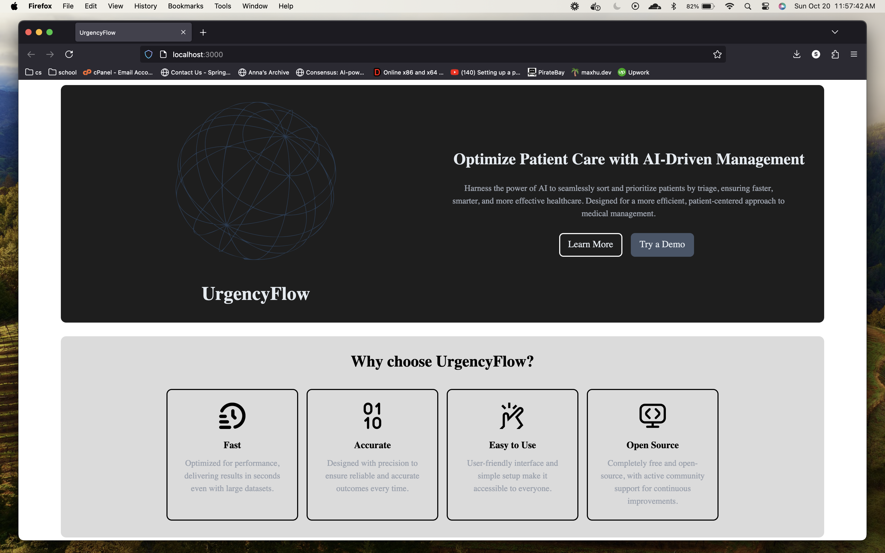

<h1 align="center">
   
  
   
  UrgencyFlow
   
</h1>

<h4 align="center">An emergency room AI priority queue system.</h4>

  <a href="#key-features">Key Features</a> •
  <a href="#how-to-use">How To Use</a> •
  <a href="#credits">Credits</a> •
  <a href="#license">License</a>

  <a href="https://www.loom.com/share/4cc19a458dea4a7fa733a0f4b6aed368">Loom Explanation Video</a>

## Key Features

* Automatically sort patients based on AI assigned serverity level.
  - Instantly view what patients must be admitted first, possibly saving their lives.
* Add Entries
  - Patient is able to be added to the queue with few inputs needed.
* View Patient information  

## How To Use

To see this project in action, view our latest deployments!

## Emailware

UrgencyFlow is an [emailware](https://en.wiktionary.org/wiki/emailware). Meaning, if you liked using this app or it has helped you in any way, I'd like you send me an email at <swiseman2005s+UrgencyFlow@gmail.com> about anything you'd want to say about this software. I'd really appreciate it!

## Credits

This software uses the following open source packages:
- [Pytorch]
- [Pandas]
- [Tailwind]
- [Numpy]
- [Scikit-learn]
- [Django]
- Vântu, A., Vasilescu, A., & Băicoianu, A. (2023). Medical Emergency Department Triage Data Processing using a machine-learning solution. Heliyon, 9(8). https://doi.org/10.1016/j.heliyon.2023.e18402 

## License

MIT

---

> [https://wash-u-hackathon24.vercel.app/index.html](https://wash-u-hackathon24.vercel.app/index.html) &nbsp;&middot;&nbsp;
> GitHub [@notSam25](https://github.com/notSam25/WashUHackathon24) &nbsp;&middot;&nbsp;

